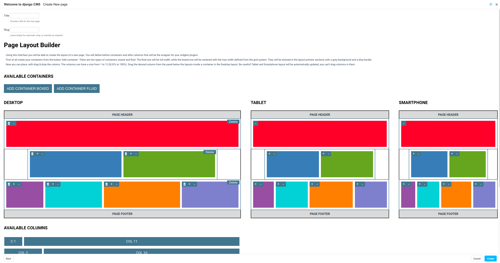

=================================
Django Cms Bootstrap Grid Builder
=================================

.. image:: https://badge.fury.io/py/django-cms-bootstrap-grid-builder.svg/?style=flat-square
    :target: https://badge.fury.io/py/django-cms-bootstrap-grid-builder

.. image:: https://readthedocs.org/projects/pip/badge/?version=latest&style=flat-square
    :target: https://django-cms-bootstrap-grid-builder.readthedocs.io/en/latest/

.. image:: https://img.shields.io/coveralls/github/frankhood/django-cms-bootstrap-grid-builder/main?style=flat-square
    :target: https://coveralls.io/github/frankhood/django-cms-bootstrap-grid-builder?branch=main
    :alt: Coverage Status

This tool offers the preliminary drafting of a grid layout consisting of containers, rows and columns,
allows you to correctly define the spaces assigned to each page content,
and to map these spaces for the different responsive steps.

Documentation
=============

The full documentation is at https://django-cms-bootstrap-grid-builder.readthedocs.io/en/latest/.

Quickstart
----------

:warning: ATTENTION !!! This package requires **django-cms** already installed.

Install Django CMS bootstrap grid builder::

    pip install django-cms-bootstrap-grid-builder

Add it to your `INSTALLED_APPS`:

.. code-block:: python

    INSTALLED_APPS = (
        ...
        'bootstrap_grid_builder',
        ...
    )

The first thing to do is to override the page creation 
wizard with the one offered by the package.

.. code-block:: python

    # project/urls.py

    from cms.cms_wizards import cms_page_wizard, cms_subpage_wizard
    from bootstrap_grid_builder.cms_wizards import cms_wizards
    from cms.wizards.wizard_pool import wizard_pool

    # OVERRIDE CMS WIZARD
    wizard_pool.unregister(cms_page_wizard)
    wizard_pool.unregister(cms_subpage_wizard)

    wizard_pool.register(cms_wizards.cms_page_wizard)
    wizard_pool.register(cms_wizards.cms_subpage_wizard)

A variable must be defined to specify the name of the placeholder
that will contain the plugins generated by the page creation wizard.

.. code-block:: python

    GRID_PLUGIN_STRUCTURE_PLACEHOLDER = "grid_placeholder"

Add the placeholder name inside your home.html template like this:

.. code-block:: html

    
    <html>
        <head>
            <title></title>
            
        </head>
        <body>
            
            
            
        </body>
    </html>

Then run migrate to apply package migrations:

::

    $ python manage.py migrate

HowTo customize Grid Plugins & Grid Plugin Models
-------------------------------------------------

You can customize the wizard-generated plugins to add functionality or fields to the basic implementation of the tool.

The plugins registered by the package are:

- GridContainerPlugin
- GridRowPlugin
- GridColPlugin

To modify one of these plugins you need:

- Create an associated model in which to add your own field.
- Create a plugin in which to insert the field previously added to the model and make the unregister of
  the base plugin and the register of the plugin just created.

.. code-block:: python

    # your_app/models.py

    class MyCustomGridContainerPluginModel(GridContainerPluginAbstractModel):
        my_field = models.CharField("My Field", max_length=255)

        class Meta:
            verbose_name = _("My Custom grid container plugin")
            verbose_name_plural = _("My Custom grid container plugins")

    # your_app/cms_plugins.py

    plugin_pool.unregister_plugin(GridContainerPlugin)

    @plugin_pool.register_plugin
    class MyCustomGridContainerPlugin(GridContainerPlugin):
        model = MyCustomGridContainerPluginModel
        module = _("Custom")
        name = _("Custom Grid Container")
        render_template = 'path/to/my/custom/template.html'

        fieldsets = (
            (None, {"fields": (
                ("variant_class", "tag_type",),
                ("my_field",),
            )}),
        )

Following these changes it is necessary to set variables in the settings.py file
to specify the name of the plugin that must be generated by the wizard instead of the base plugin.

.. code-block:: python

    # project/settings.py

    GRID_CONTAINER_PLUGIN = "MyCustomGridContainerPlugin"
    # this are the others plugins variables
    GRID_COL_PLUGIN = ""
    GRID_ROW_PLUGIN = ""

After models creation run makemigration & migrate to create yours models in database.

::

    $ python manage.py makemigrations
    $ python manage.py migrate

Running Tests
-------------

::

    source <YOURVIRTUALENV>/bin/activate
    (myenv) $ pip install tox
    (myenv) $ tox

Development commands
---------------------

::

    # Back-end
    $ pip install -r requirements_dev.txt
    $ pre-commit install
    $ python manage.py migrate
    $ python manage.py runserver

Frontend
========
This is a Vue.js application for creating custom bootstrap grids throughout an intuitive interface and draggable elements

Browser Compatibility
---------------------
The page-layout-builder component is compatible with modern browsers such as Chrome, Firefox, Safari, Opera, and Edge. It also supports Internet Explorer 11 but with limited performance.

Frontend source folder ascii tree
---------------------------------

::

  /django-cms-bootstrap-grid-builder/src
  ├─ main.js  //Entrypoint for build
  ├─ index.js  //Entrypoint for development
  ├─ components
  │  ├─ CustomDragElement.vue
  │  ├─ page-layout-builder.vue
  │  ├─ GridItem.vue
  │  ├─ GridLayout.vue
  │  └─ index.js
  └─ helpers
     ├─ DOM.js
     ├─ draggableUtils.js
     ├─ responsiveUtils.js
     └─ utils.js

How it works
---------------------------------
The informations obtained from the interface configuration are serialized into a JSON object and sent to the backend wich replicates the desired grid structure with Django plugins templates

Development commands
---------------------

::

    # Front-end
    $ npm i -g yarn rimraf @vue/cliz
    $ yarn install
    $ yarn serve (for development, lauches local live reloading server)
    $ yarn build (for production build, creates dist at django-cms-bootstrap-grid-builder/bootstrap_grid_builder/static/cms_plugin_structure/dist)

Credits
-------

Tools used in rendering this package:

*  `Cookiecutter <https://github.com/audreyr/cookiecutter/>`_
*  `cookiecutter-djangopackage <https://github.com/pydanny/cookiecutter-djangopackage/>`_
*  `element-resize-detector <https://github.com/wnr/element-resize-detector/>`_
*  `interactjs <https://interactjs.io/>`_
*  `vue-drag-drop <https://github.com/cameronhimself/vue-drag-drop/>`_
*  `google-palette <https://github.com/google/palette.js/tree/master/>`_
*  `bootstrap <https://github.com/twbs/bootstrap/>`_
